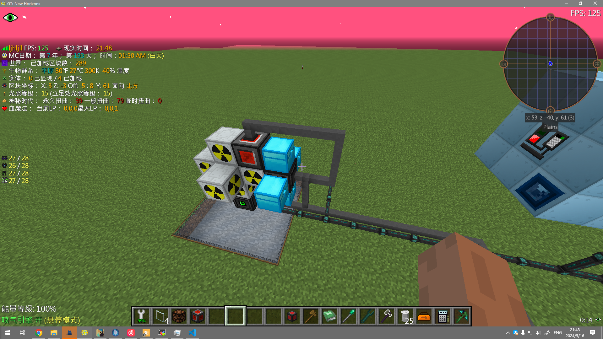

# GTNH-NuclearCooler

基本使用流程:
1. 准备一套OC(高级机箱、内存条、显示器、键盘、磁盘驱动器、红石IO端口2个、一些线缆、BIOS、高级处理器(cpu)、基础显卡、转运器、适配器等等
2. 装机后将lua文件放入存档中的opencomputers/{设备id}下
3. 编辑config.lua,释义已在文件中标注,使用oc中的分析器右键红石端口可以直接复制它的地址id
    文件中的方向是可通过开F3等方式来获取（请以转运器为基准来区分方向)
4. 开机启动！

搭建的结构参考：

# 必看常见问题
1. 请不要使用windows记事本编辑器进行config.lua的修改,会导致程序无法使用
2. 默认的config.lua中包含了mox99%强冷堆、4连强冷铀堆的默认配置，请按照自己的组件地址进行修改

- [x] 删去无用的散热代码
- [x] 完成99%核电测试及处理
- [ ] 简化结构使其得以更少的组件管理更多的核电
