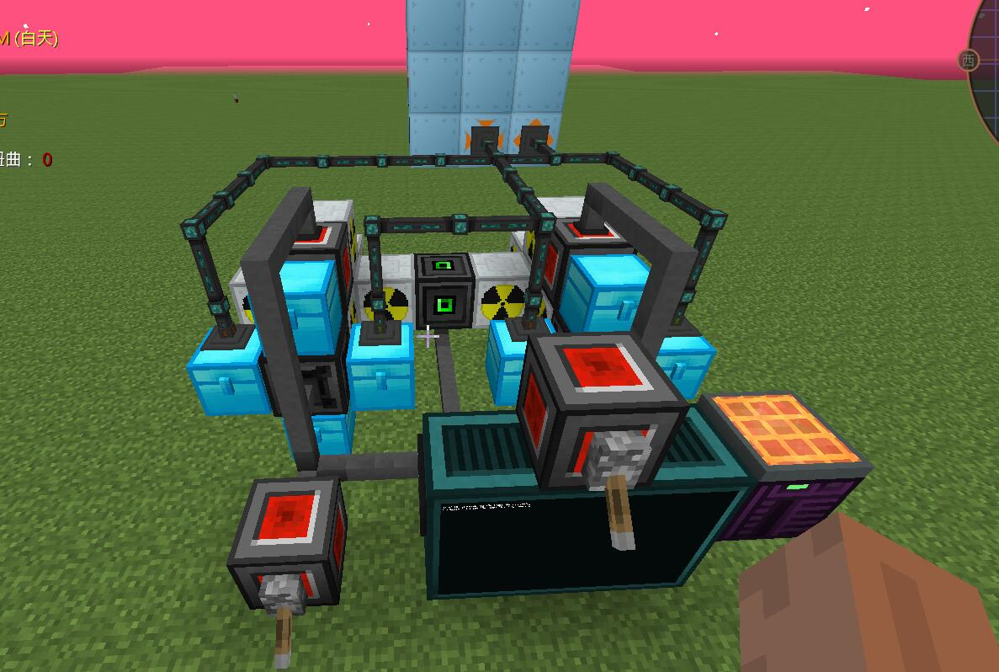

# GTNH-NuclearCooler

**GTNH 2.6.x 测试中**

相比于ljhljll/GTNH-NuclearCooler的修改：

1. 修复全局开关关闭时，运行justStart仍然会运行核反应堆（但是又会运行失败）的bug。现在全局开关关闭时启动justStart会提示未开启全局开关，然后停止运行。
2. 使用coroutine手动调度，相比于原先thread+sleep的自动调度，理论上讲应该能够减少延迟，进一步降低爆炸风险。(OC的Lua的thread也是用协程实现的，但是由OC电脑调度，coroutine可以由程序自己调度）

基本使用流程:
1. 准备一套OC(T3CPU或者T3APU，T3机箱、T3内存条、T3显示器、键盘、磁盘驱动器、红石IO端口2个、一些线缆、BIOS、高级处理器(cpu)、基础显卡、转运器、适配器等等。（具体搭建计算机的方式参考相关资料）
2. 装机后将本项目的所有lua文件放入机器的主目录内，或者可以放到存档中的opencomputers/{设备id}下（机器也能够读取到）
3. 编辑config.lua,释义已在文件中标注,使用oc中的分析器右键红石端口可以直接复制它的地址id
    文件中的方向是可通过开F3等方式来获取（请以转运器为基准来区分方向)
4. 开机启动！（使用justStart命令）

搭建的结构参考：

# 必看常见问题
1. 请不要使用windows记事本编辑器进行config.lua的修改,会导致程序无法使用
2. 默认的config.lua中包含了mox99%强冷堆、4连强冷铀堆的默认配置，请按照自己的组件地址进行修改

- [x] 删去无用的散热代码
- [x] 完成99%核电测试及处理
- [x] 简化结构使其得以更少的组件管理更多的核电
- [x] 自行控制反应堆是否参与电量控制
- [x] 16套4连核电低tps运行30*24小时不停机稳定运行
